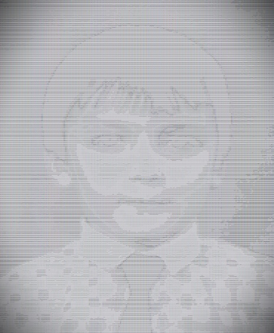

# Рыбаков Максим Николаевич

### О себе:

**Место на карте:** г.Йошкар-Ола.  
**Основная занятость:** врач-анестезиолог-реаниматолог.  
Обучаюсь Android-разработке в свободное от основной работы время.  
***Высоко мотивирован в освоении новой профессии.***

### Навыки:

* английский язык (elementary)
	>продолжаю развиваться в этом направлении
* программирование на Java 
	>освоил основы работы с IntelliJ IDEA, создавал небольшие
	>консольные приложения на базе различных типов
	>данных и вариантов их хранения, освоил принципы ООП
* работа с Git и GitHub
	>~~собственно, так я и создаю это "резюме"~~
